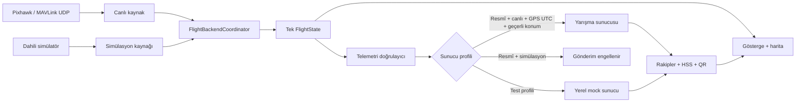

# Canlı Veri / Simülasyon Akışı

Bu belge, YKİ içindeki uçuş verisinin hangi kaynaktan geldiğini ve yarışma
sunucusuna hangi koşullarda gönderilebildiğini tanımlar.

## Temel kural

Kendi İHA telemetrisi canlı kullanımda Pixhawk/MAVLink hattından gelir.
`/api/telemetri_gonder` cevabındaki konumlar yalnızca diğer takımlar içindir;
kendi İHA konumunun kaynağı olarak kullanılmaz.

## Mod değiştirme

- Uygulama her açılışta canlı MAVLink dinleyicisiyle başlar. Eski bir
  simülasyon tercihi diskten otomatik uygulanmaz.
- Simülasyona geçiş ve canlıya dönüş yalnızca Ayarlar ekranındaki onay
  modalından sonra yapılır.
- Geçiş sırasında aktif kaynak durdurulur, uçuş komut hattı geçici olarak
  bloke edilir, ortak durum geçersiz işaretlenir ve yeni kaynak başlatılır.
- Yeni kaynak hazır olmadan sistem `CANLI` veya `SİMÜLASYON` sayılmaz.
- Simülasyondan canlıya dönüldüğünde sahte HSS, rakip, rota izi ve kendi İHA
  işareti temizlenir.
- Kaynak başlatılamazsa komut hattı bloke kalır; önceki veya yarım kalmış
  veriler yarışma sunucusuna gönderilmez.

## Yarışma sunucusuna gönderim kapısı

Resmî profilde bütün koşullar sağlanmalıdır:

1. Aktif backend canlı ve hazır olmalı.
2. Telemetri güncel olmalı.
3. En az 3D GPS fix bulunmalı.
4. Konum sıfır/boş olmamalı.
5. `gps_saati` doğrudan araç GPS verisinden ve UTC+0 olmalı.
6. Takım numarası başarılı girişten alınmış olmalı.
7. Paket alanları dokümandaki aralıklardan geçmeli.

Test/mock profilinde simülasyon paketleri yalnızca
`http://127.0.0.1:5000`/`localhost:5000` yerel mock sunucusuna gönderilebilir.
Profil seçimi, simülasyon izninden ayrıdır; resmî profilde veya başka bir URL'de
simülasyon hiçbir zaman gönderim yetkisi vermez.

## Bilinen güvenlik sınırı

Canlı MAVLink adaptörü şu aşamada salt-okunurdur. Canlı uçuş komutları
(`ARM`, `RTL`, `LAND`, waypoint vb.) fiziksel araca gönderilmez ve kullanıcıya
engellendi uyarısı verilir. Bu güvenli varsayılan kaldırılmadan önce MAVLink
komut onayı, hedef system/component kimliği, ACK takibi ve uçuş testleri
tamamlanmalıdır.

KTR iskeleti “GCS haberleşme kaybı 10 saniye → otonom iniş” derken mevcut
uygulama politikası RTL çağrısı üretmektedir. Canlı komut adaptörü açılmadan
önce uçuş emniyet sorumlusu tarafından `LAND`/`RTL` kararı yazılı olarak
nihaileştirilmelidir.
